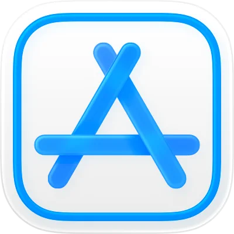

<p align="center">
  
</p>
<p align="center">
  <h1 align="center">App Store Connect MCP</h1>
</p>
<p align="center">
  App Store Connect in your AI agent. MCP server for the official App Store Connect API.
</p>
<div align="center">

[](https://www.npmjs.com/package/mcp-asc)
[](https://github.com/beautyfree/appstore-connect-mcp/blob/main/LICENSE)

</div>

A [Model Context Protocol](https://modelcontextprotocol.io) (MCP) server that connects [Cursor](https://cursor.com), [Claude Desktop](https://claude.ai), and other MCP clients to the official [App Store Connect API](https://developer.apple.com/documentation/appstoreconnectapi)—so you can manage iOS/macOS apps, TestFlight, in-app subscriptions, and store metadata via chat or automated tool calls instead of clicking through the App Store Connect UI.

**Use it to:** list and inspect apps, builds, and beta groups · manage TestFlight testers and review submissions · create and update subscription groups and prices · edit App Store version localizations and "What's New" · download sales and finance reports · list Xcode schemes and CI products. All with JWT auth and the same API Apple's own tools use.

## Install

**Cursor (install link):**

[](https://cursor.com/en-US/install-mcp?name=app-store-connect&config=eyJjb21tYW5kIjoibnB4IiwiYXJncyI6WyIteSIsIm1jcC1hc2MiXSwiZW52Ijp7IkFQUF9TVE9SRV9DT05ORUNUX0tFWV9JRCI6IllPVVJfS0VZX0lEIiwiQVBQX1NUT1JFX0NPTk5FQ1RfSVNTVUVSX0lEIjoiWU9VUl9JU1NVRVJfSUQiLCJBUFBfU1RPUkVfQ09OTkVDVF9QOF9QQVRIIjoiL3BhdGgvdG8veW91ci9hdXRoLWtleS5wOCIsIkFQUF9TVE9SRV9DT05ORUNUX1ZFTkRPUl9OVU1CRVIiOiJZT1VSX1ZFTkRPUl9OVU1CRVJfT1BUSU9OQUwifX0%3D)

**Other clients (Claude Desktop, etc.):**

```bash
npx add-mcp mcp-asc
```

## Configure

Add the server to your MCP config and set these environment variables:

| Variable | Required | Description |
|----------|----------|-------------|
| `APP_STORE_CONNECT_KEY_ID` | Yes | API Key ID from App Store Connect |
| `APP_STORE_CONNECT_ISSUER_ID` | Yes | Issuer ID from App Store Connect |
| `APP_STORE_CONNECT_P8_PATH` | Yes | Path to your `.p8` private key file |
| `APP_STORE_CONNECT_VENDOR_NUMBER` | For reports | Needed for sales/finance reports |

Create an API key at [App Store Connect → Users and Access → Integrations → App Store Connect API](https://appstoreconnect.apple.com/access/integrations/api). Download the `.p8` and note Key ID and Issuer ID.

**Example (stdio):**

```json
{
  "mcpServers": {
    "app-store-connect": {
      "command": "npx",
      "args": ["-y", "mcp-asc"],
      "env": {
        "APP_STORE_CONNECT_KEY_ID": "YOUR_KEY_ID",
        "APP_STORE_CONNECT_ISSUER_ID": "YOUR_ISSUER_ID",
        "APP_STORE_CONNECT_P8_PATH": "/path/to/AuthKey_XXXXX.p8",
        "APP_STORE_CONNECT_VENDOR_NUMBER": "YOUR_VENDOR_NUMBER_OPTIONAL"
      }
    }
  }
}
```

**Example (HTTP SSE):** Run `npm run build` then `npm run start:http`. Point your client at `http://localhost:3001/mcp` with the same env vars.

## Tools

Tools are exposed in kebab-case. Use your MCP client to list them and see parameters. Summary by area:

**Apps & metadata**
- `list-apps`, `get-app`, `list-app-infos`, `get-app-info`, `get-app-availability`
- `list-app-store-versions`, `get-app-store-version`, `create-app-store-version`, `update-app-store-version`
- `list-app-store-version-localizations`, `list-app-categories`, `list-app-encryption-declarations`, `list-nominations`

**TestFlight / Beta**
- `list-beta-groups`, `get-beta-group`, `list-beta-testers`, `get-beta-tester`, `add-beta-testers-to-group`, `remove-beta-testers-from-group`
- `list-builds`, `get-build`, `list-build-beta-details`, `list-pre-release-versions`, `get-pre-release-version`
- `list-beta-app-localizations`, `list-beta-app-review-details`, `list-beta-app-review-submissions`, `list-beta-license-agreements`, `get-beta-license-agreement`, `update-beta-license-agreement`

**Subscriptions**
- `list-subscription-groups`, `list-subscription-group-subscriptions`, `get-subscription`, `create-subscription-group`, `create-subscription`
- `create-subscription-availability`, `list-subscription-price-points`, `create-subscription-price`, `create-subscription-localization`

**Store & review**
- `list-review-submissions`, `get-review-submission`, `submit-for-review`, `list-customer-reviews`, `create-customer-review-response`
- `get-app-store-review-detail`, `update-app-store-review-detail`

**Other**
- `list-bundle-ids`, `get-bundle-id` · `list-certificates`, `get-certificate` · `list-profiles` · `list-devices`, `get-device`
- `list-users`, `get-user`, `list-user-invitations` · `list-territories` · `list-actors`, `get-actor`
- `get-eula`, `update-eula` · `get-phased-release`, `create-phased-release` · `update-age-rating-declaration`
- `list-schemes` (Xcode), `list-ci-products` (Xcode Cloud)
- `download-sales-report`, `download-finance-report` (require `APP_STORE_CONNECT_VENDOR_NUMBER`)

## Development

Built with [xmcp](https://xmcp.dev/docs). One tool per file under `src/tools/`; each file exports `metadata` and a default handler.

```bash
npm install
npm run build
npm run start:stdio   # or npm run start:http for HTTP transport
npm run dev            # watch + run
```

Node 20+.

## License

MIT.

## Links

- [Model Context Protocol](https://modelcontextprotocol.io)
- [App Store Connect API](https://developer.apple.com/documentation/appstoreconnectapi)
- [xmcp](https://xmcp.dev/docs)
